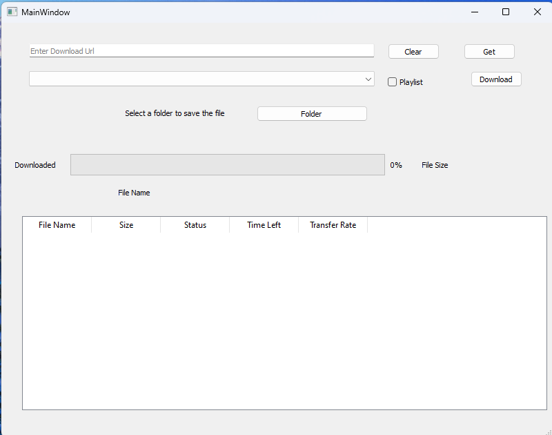
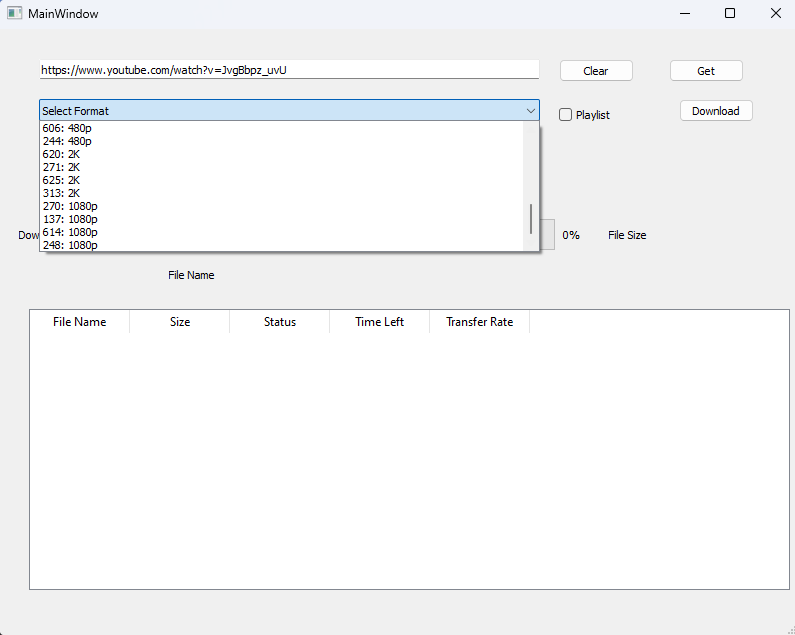
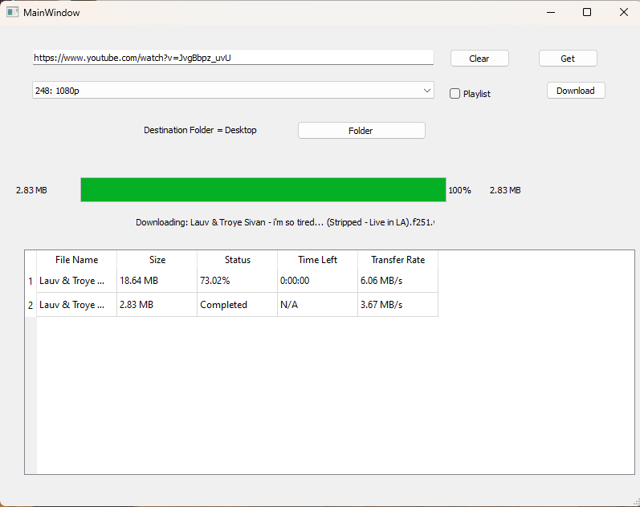

# YouTube Downloader with PyQt5

A PyQt5 application for downloading videos and audio from YouTube using `yt-dlp`.

## Features

- Download YouTube videos in various formats (audio-only, 720p, 1080p, 1440p, 2K, 4K).
- Display progress bar and status updates during the download process.
- Support for downloading the first video from playlists.
- Save downloaded files to a user-selected directory.
- Store and display completed downloads in a table.

## Requirements

- Python 3.6+
- PyQt5
- yt-dlp
- SQLite (for storing completed downloads)

## Installation

1. Clone the repository:

   ```bash
   git clone https://github.com/chegedennis/ytdlp-downloader.git
   cd your-repo-name
   ```

2. Install the required dependencies:

   ```bash
   pip install -r requirements.txt
   ```

3. Ensure `yt-dlp` is installed. You can install it via pip if it is not already installed:

   ```bash
   pip install yt-dlp
   ```

## Usage

1. Run the application:

   ```bash
   python main.py
   ```

2. Enter a YouTube URL in the provided text field.

3. Select the desired format from the dropdown list.

4. Click the "Download" button to start the download process.

5. Use the "Clear" button to clear the input fields and reset the UI.

6. Click the folder button to select the download directory.

## Code Overview

### main.py

- **Classes:**

  - `DownloadWorker`: A worker thread to handle downloading videos in the background.
  - `MainWindow`: The main window for the PyQt5 application.

- **Functions:**
  - `create_db_dir()`: Create a directory named `.dbs` if it doesn't exist.
  - `parse_formats(output)`: Parse the format options from the `yt-dlp` output.

### db_functions.py

- **Functions:**
  - `create_database_or_database_table(db_name)`: Create a database or database table for storing completed downloads.
  - `insert_completed_download(data)`: Insert a completed download record into the database.
  - `retrieve_all_completed_downloads()`: Retrieve all completed download records from the database.

## Screenshots

## Main Window


<p align="center"><em>Description of the main window.</em></p>

## Format Selection


<p align="center"><em>Description of the Format selection.</em></p>

## Download Progress


<p align="center"><em>Description of the download progress.</em></p>

## License

This project is licensed under the MIT License. See the [LICENSE](LICENSE) file for details.

## Contributing

Contributions are welcome! Please open an issue or submit a pull request for any improvements or bug fixes.

## Acknowledgements

- [yt-dlp](https://github.com/yt-dlp/yt-dlp) for providing the core downloading functionality.
- [PyQt5](https://www.riverbankcomputing.com/software/pyqt/intro) for the graphical user interface.
